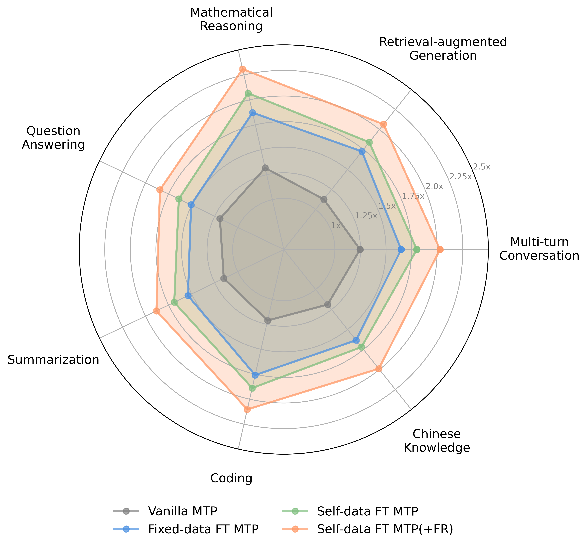

<div align="center">

# *FastMTP:* Accelerating LLM Inference with <br>Enhanced Multi-Token Prediction

<a href="https://github.com/yukiwayx/FastMTP" target="_blank">
    
</a>
<a href="https://github.com/yukiwayx/FastMTP" target="_blank">
    
</a>

<br>
</div>

## Introduction

We present FastMTP, a simple yet effective method that enhances Multi-Token Prediction (MTP) performance for speculative decoding during inference. Our approach fine-tunes a single MTP head with shared weights across multiple causal draft steps, enabling it to effectively learn recursive multi-step prediction patterns compatible with EAGLE-style speculative decoding. By integrating FR-Spec vocabulary space compression into the MTP head, we further reduce computational overhead in the drafting process. Experimental results across multiple benchmarks demonstrate that FastMTP achieves an average of **2.03× speedup** compared to standard next token prediction, while maintaining lossless generation quality. The method requires lightweight training process and seamlessly integrates with existing inference frameworks, offering a practical and rapidly deployable solution for accelerating LLM inference.

🌟 For more details, please refer to our [technical report](https://github.com/yukiwayx/FastMTP).

<div align="center">
  
</div>
<div align="center">
<font color="gray">Speedup comparison of different methods across subtasks, evaluated on a single A10 GPU.</font>
</div>

## ⚙️ Installation

### Training Environment

Model training was performed on A100 or H20 GPUs with the following environment:

* `python 3.10`
* `torch 2.7.1+cu128`
* `flash_attn 2.8.2`

``` bash
conda create -n env-3.10 python=3.10 -y
conda activate env-3.10
pip install -r requirements.txt

cd ms-swift-3.6.4
pip install -e .

cd ..
cd transformers-4.54.0
pip install -e .
```

### Evaluation Environment

Evaluation experiments were mainly conducted on a single A10 GPU with the following environment:

* `python 3.12.11`
* `torch 2.8.0`
* `cuda 12.8`

``` bash
pip install sglang[all]
```

## 🚀 Getting Started

### Prepare model

Download the corresponding model weights to the ```model``` folder.

``` bash
# Make sure git-lfs is installed
cd model
git clone https://huggingface.co/XiaomiMiMo/MiMo-7B-RL

# Replace with our customized configuration
cp config.json MiMo-7B-RL/config.json
```

### Launch Training

``` bash
sh sft.sh
```

### Evaluation

#### Step 1: Launch a server

Start the server with the following command:

``` bash
export PYTORCH_CUDA_ALLOC_CONF=expandable_segments:True

python3 -m sglang.launch_server \
        --model-path <model_path> \
        --trust-remote-code \
        --mem-fraction-static 0.7 \
        --max-running-requests 1 \
        --tensor-parallel-size 1 \
        --cuda-graph-max-bs 1 \
        --speculative-algorithm EAGLE \
        --speculative-num-steps 3 \
        --speculative-eagle-topk 1 \
        --speculative-num-draft-tokens 4 \
        --speculative-token-map <freq_map_path>
```

* ```<model_path>```: Path to the model folder
* ```<freq_map_path>```: Path to the high-frequency token vocabulary

Note: Use the original ```config.json``` in ```<model_path>``` for evaluation.

Model weights are available at Huggingface ([see here](https://github.com/yukiwayx/FastMTP)).

Processed high-frequency token vocabularies (```Qwen2Tokenizer```-based models) can be downloaded at:

* English: [Qwen2-7B-Instruct-FR-Spec](https://huggingface.co/thunlp/Qwen2-7B-Instruct-FR-Spec)
* Chinese: [MiMo-7B-RL-FR-Spec-zh](https://github.com/yukiwayx/FastMTP)

#### Step 2: Run the benchmark

Open a new terminal and execute:

``` bash
cd evaluation/<benchmark>
python3 bench_sglang_eagle.py

# Example: MT-Bench evaluation
cd evaluation/mt_bench
python3 bench_sglang_eagle.py \
  --question-file question.jsonl \
  --num-questions 80 \
  --temperature 0 \
  --max-gen-length 1024 \
  --answer-file <answer_file> \
  --result-file <result_file>
```

## Acknowledgments

* [ms-swift](https://github.com/modelscope/ms-swift) and [transformers](https://github.com/huggingface/transformers): Training codebase we modified and built upon.
* [SGLang](https://github.com/sgl-project/sglang): Codebase used for inference.
* [thunlp/FR-Spec](https://github.com/thunlp/FR-Spec): The Fr-Spec method integrated in our MTP head.
* [XiaomiMiMo/MiMo-7B-RL](https://huggingface.co/XiaomiMiMo/MiMo-7B-RL): Model for our experiments.

## Citation

If you find the resources in this repository useful, please cite our paper:

``` bib
@article{cai2025fastmtp,
  title={FastMTP: Accelerating LLM Inference with Enhanced Multi-Token Prediction},
  author={Cai, Yuxuan and Yin, Yuyang and Chen, Xi},
  journal={arXiv preprint arXiv:2509.xxxx},
  year={2025}
}
```
